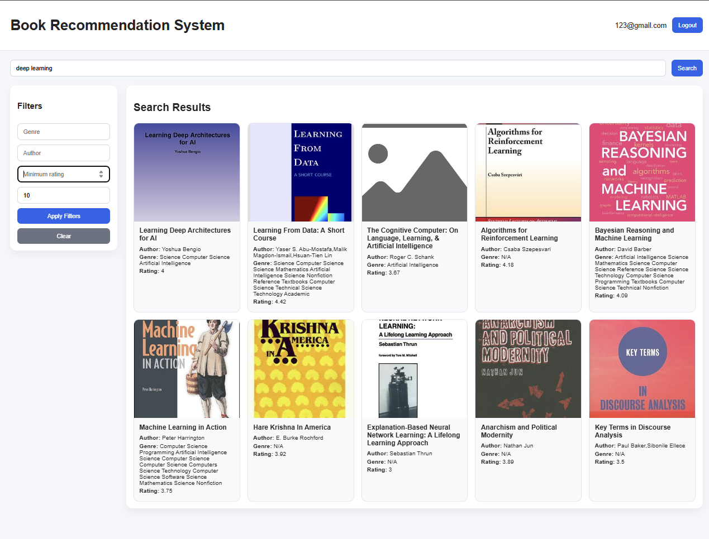
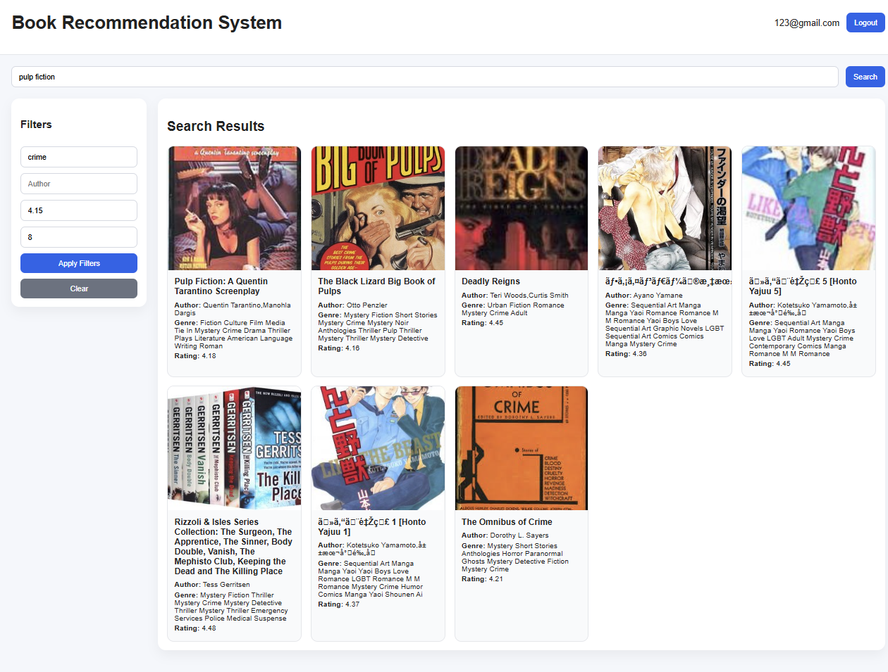

# Book Recommendation System

An end-to-end **book recommendation system** built with **Sentence-transformers, FastAPI, JWT authentication, MySQL, React, Docker, and AWS-ready deployment practices**.

The system recommends books using **semantic embeddings**, supports **metadata-based filtering**, provides **user authentication**, stores **user search history**, and serves a simple frontend for interaction.

---

## Dataset

- **Dataset:** Goodreads 100K Books
- **Source:** [Kaggle - goodreads-books-100k](https://www.kaggle.com/datasets/mdhamani/goodreads-books-100k)

---

## Project Overview

This project started with the Goodreads dataset and initially explored both **TF-IDF** and **E5 embeddings** for recommendation.  
**E5 performed better than TF-IDF** because TF-IDF mainly relies on exact word overlap, while E5 captures deeper semantic meaning. As a result, E5 can recommend books that are conceptually similar even when they do not share many exact keywords.

The recommendation pipeline uses:

- **semantic retrieval** with `intfloat/multilingual-e5-base`
- **metadata filtering** using fields like genre, author, and minimum rating
- **weighted popularity ranking** for trending books
- **JWT authentication** for secure user access
- **MySQL database** for storing user information and search history
- **React frontend** for user interaction
- **Docker** for containerization

---

## Weighted Popularity Score

To avoid low-sample books dominating the rankings, the system uses an **IMDb-style weighted popularity score**.

### Why weighted score?

A book with **5.0 rating from 3 users** should not rank above a book with **4.6 rating from 50,000 users**.  
Weighted score balances **average rating** and **number of ratings**, making trending results more reliable.


### Weighted Rating Formula

WR = (v / (v + m)) * R + (m / (v + m)) * C

Where:

- `WR` = weighted rating
- `R` = average rating of the book
- `v` = number of votes/ratings for the book
- `m` = minimum votes required to be listed
- `C` = mean rating across the whole dataset

### Example

Suppose:

- Book A: `R = 5.0`, `v = 3`
- Book B: `R = 4.6`, `v = 50000`
- Dataset mean rating `C = 4.0`
- Minimum votes `m = 1000`

Then Book A gets pulled down strongly because it has very few ratings, while Book B remains highly ranked because it has both a strong rating and many votes.

This makes the global trending section more realistic.

---

## Artifacts

After preprocessing and embedding generation:

- metadata was saved as `books.pkl`
- embeddings were saved as `embeddings.npy`

These artifacts were uploaded to **Google Drive** and loaded by the backend when needed.

---

## Features

### Recommendation Features

- semantic recommendation using **E5 embeddings**
- fallback to **popular books**
- metadata filtering:
  - genre
  - author
  - minimum rating
- support for:
  - query only
  - query + filters
  - filters only

### Backend Features

- **FastAPI** routes for serving recommendations
- **Pydantic schemas** for request validation
- **rate limiting middleware** to control request frequency
- **JWT authentication** for secure access
- **MySQL integration** for storing users and search history
- protected routes for authenticated users

### Frontend Features

The frontend was built using:

- **React**
- **Vite**
- **Axios**
- **React Router**

Frontend flow:

- user can register/login
- homepage shows:
  - **Trending Books** (global top 5)
  - **Recently Recommended For You** (user-specific recent 5)
- search bar at the top
- filter sidebar on the left
- placeholder image support for missing book covers

### Deployment Features

- backend and frontend are **containerized with Docker**
- frontend and backend are separated into **different images**
- images are pushed to **Docker Hub**
- project is structured to be deployed later on **AWS**

---

## Project Structure

```bash
book-recommendation-system
├── app
│   ├── core
│   │   ├── config.py
│   │   ├── security.py
│   │   └── rate_limit.py
│   ├── db
│   │   ├── database.py
│   │   └── models.py
│   ├── routes
│   │   ├── app.py
│   │   ├── auth.py
│   │   └── recommendation.py
│   ├── schemas
│   │   ├── auth.py
│   │   └── recommendation.py
│   ├── artifact_loader.py
│   ├── model_loader.py
│   ├── recommender.py
│   └── recommender_service.py
├── frontend
├── books.pkl
├── embeddings.npy
├── requirements.txt
├── .env
└── .venv
```

# How to Use the Project

This project can be run in two ways:

1. GitHub Version (without Docker)
2. Docker Version (containerized setup)

---

## 1. GitHub Version (Without Docker)

### Step 1: Clone the Repository

```bash
git clone <repo-link>
cd book-recommendation-system
```

---

### Step 2: Set Up Python Environment

Install Python, pip, and virtual environment tools, then create and activate a virtual environment.

```bash
sudo apt update
sudo apt install python3 python3-pip python3-venv
python3 -m venv .venv
source .venv/bin/activate
```

---

### Step 3: Install Dependencies

Install all required Python packages.

```bash
pip install -r requirements.txt
```

---

### Step 4: Create Environment File

Create a `.env` file in the root directory and configure:

- Database credentials
- JWT secret key
- Algorithm
- Token expiration time

```bash
DB_USER=root
DB_PASSWORD=your_password
DB_HOST=127.0.0.1
DB_PORT=3306
DB_NAME=book_recommender_db

SECRET_KEY=your_secret_key
ALGORITHM=HS256
ACCESS_TOKEN_EXPIRE_MINUTES=30
```

---

### Step 5: Run Backend Server

Start the FastAPI server.

```bash
python -m uvicorn app.routes.app:app --reload
```

⚠️ Note:

- On the first run, the system may download `books.pkl` and `embeddings.npy`
- This can take a few minutes depending on your internet speed

---

### Step 6: Run Frontend

Open a new terminal and navigate to the frontend directory.

Install dependencies and start the frontend development server.

```bash
cd frontend
npm install
npm run dev
```

---

### Step 7: Access Application

Open your browser and go to:

- Frontend: `http://localhost:5173`
- Backend API Docs: `http://localhost:8000/docs`

---

## 2. Docker Version (Containerized Setup)

### Step 1: Pull Docker Images

Pull both frontend and backend images from Docker Hub.

```bash
docker pull foyez063/book-recommender-frontend
docker pull foyez063/book-recommender-backend
```

---

### Step 2: Create Environment File

Create a `.env` file with:

- Database configuration (use `DB_HOST=db`)
- JWT configuration

```bash
DB_USER=root
DB_PASSWORD=your_password
DB_HOST=db
DB_PORT=3306
DB_NAME=book_recommender_db

SECRET_KEY=your_secret_key
ALGORITHM=HS256
ACCESS_TOKEN_EXPIRE_MINUTES=30
```

---

### Step 3: Create Docker Compose File

Create a `docker-compose.yml` file that defines:

- MySQL database service
- Backend service
- Frontend service

```bash
services:
  db:
    image: mysql:8.4
    container_name: book_db
    restart: unless-stopped
    environment:
      MYSQL_ROOT_PASSWORD: ${DB_PASSWORD}
      MYSQL_DATABASE: ${DB_NAME}
    ports:
      - "3307:3306"
    volumes:
      - mysql_data:/var/lib/mysql

  backend:
    image: foyez063/book-recommender-backend:latest
    container_name: book_backend
    restart: unless-stopped
    env_file:
      - .env
    depends_on:
      - db
    ports:
      - "8000:8000"

  frontend:
    image: foyez063/book-recommender-frontend:latest
    container_name: book_frontend
    restart: unless-stopped
    depends_on:
      - backend
    ports:
      - "5173:5173"

volumes:
  mysql_data:
```

---

### Step 4: Run Containers

Start all services using Docker Compose.

```bash
docker compose up
```

---

### Step 5: Access Application

Open your browser:

- Frontend: `http://localhost:5173`

---

### Important Notes

- The first run may take 5–10 minutes due to model/artifact loading
- If registration fails initially, wait and try again
- Backend might still be initializing during this time

---

## Accessing the Database (Docker)

You can inspect the MySQL database running inside Docker.

```bash
docker exec -it book_db mysql -u root -p
```

Then:

- Select the database
- Query the `users` table to verify stored data

```bash
USE book_recommender_db;
SELECT * FROM users;
```

---

# Screenshots

| UI Preview | UI Preview |
|-----------|-----------|
|  |  |

---

# Future Improvements

- Move artifacts to S3
- Use AWS RDS for database
- Deploy on EC2
- Add personalized recommendation logic
- Add CI/CD pipeline
- Optimize Docker image size

---

# Author

Foyez Ahmed Dewan
